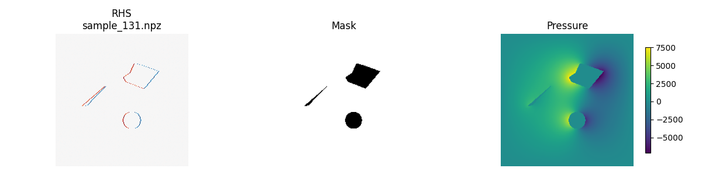

# PoissoNet

**PoissoNet** is a neural network surrogate for solving the 2D pressure Poisson equation in incompressible fluid flow. The network learns to predict pressure fields from intermediate velocity divergence (`rhs`) and geometry masks, replacing traditional solvers like Conjugate Gradient (CG) with fast, differentiable inference.

---

## What We’ve Built So Far

### Static CFD Simulation Pipeline [(Visit SimuFlow)](https://github.com/obelisk2u/SimuFlow)

- **Governing equations**: Incompressible Navier–Stokes with finite difference discretization
- **Pressure solve**: Sparse matrix Poisson solver using SciPy’s `spsolve()`
- **Obstacle handling**: Mask-based enforcement of solid boundaries
- **Velocity correction**: Pressure gradient projected back into velocity field
- **Passive scalar**: Dye injected to visualize flow around obstacles

### Data Generation Framework

- **Grid**: 200×200 uniform Cartesian mesh
- **Inputs per sample**:
  - `rhs`: divergence of intermediate velocity field (∇·u\*)
  - `mask`: 2D binary mask for geometry (1 = fluid, 0 = solid)
  - `pressure`: ground‑truth solution of Poisson equation
- **Obstacle types**:
  - Circles
  - Polygons
  - Organic “blob” shapes from thresholded Gaussian noise
- **Validation filters**:
  - Ensures minimum fluid coverage
  - Prevents degenerate samples (e.g., fully blocked domains)

---

## Next Steps

### Model Training

- Implement a U‑Net architecture in PyTorch for `pressure = f(rhs, mask)`
- Normalize inputs and output dynamically
- Train on 5k–10k samples using MSE loss
- Add divergence penalty (optional) as a physics constraint

### Replace CFD Poisson Step

- Drop in PoissoNet as a surrogate for `spsolve()`
- Measure speedup and pressure accuracy
- Validate using dye visualization and ∇·u tracking

### Scaling and Optimization

- Convert dataset to a single `.npz` or HDF5 file for efficient loading
- Add batching, augmentation (noise, rotation), and cloud storage support
- Optional: train a resolution‑agnostic model (e.g., with FNO)

---

## Example Sample

## 

## Motivation

Solving the Poisson equation is the dominant bottleneck in time‑stepping incompressible CFD making up ~97% of the elapsed time. PoissoNet offers a fast, learnable, and GPU‑accelerated alternative that could eventually enable real‑time simulation, differentiable physics, or surrogate‑based optimization.
